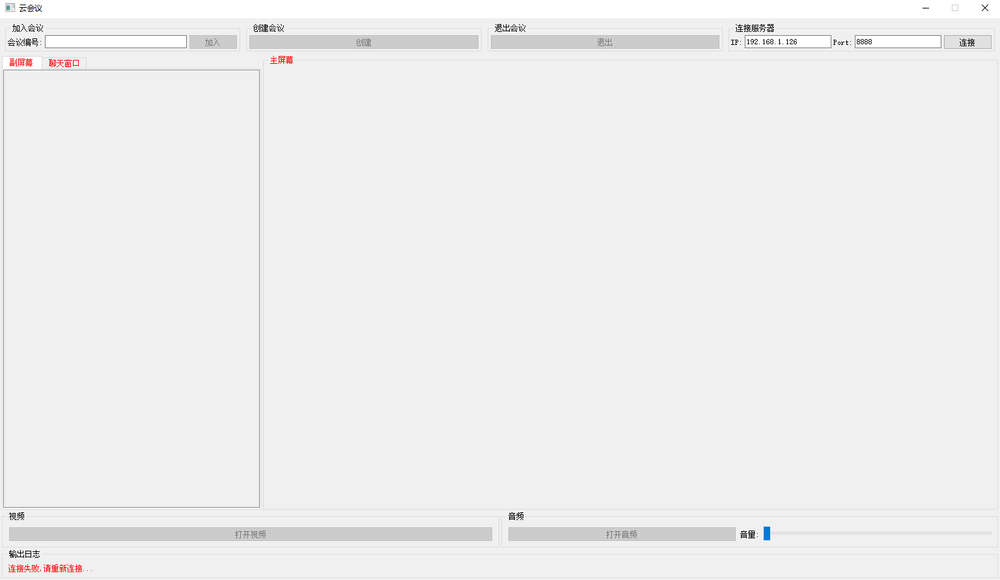
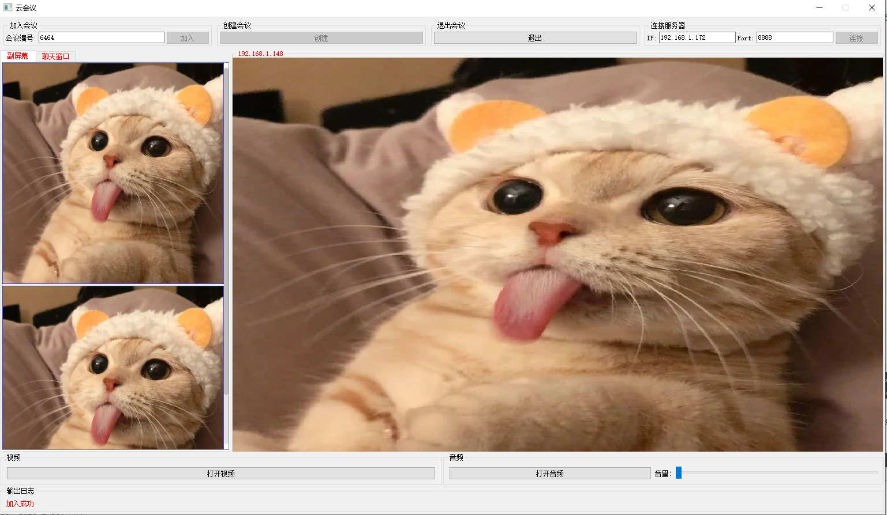
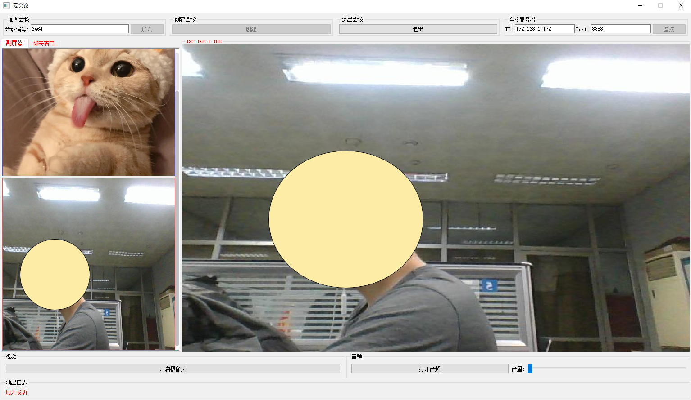
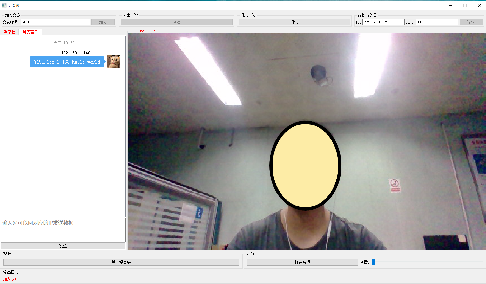
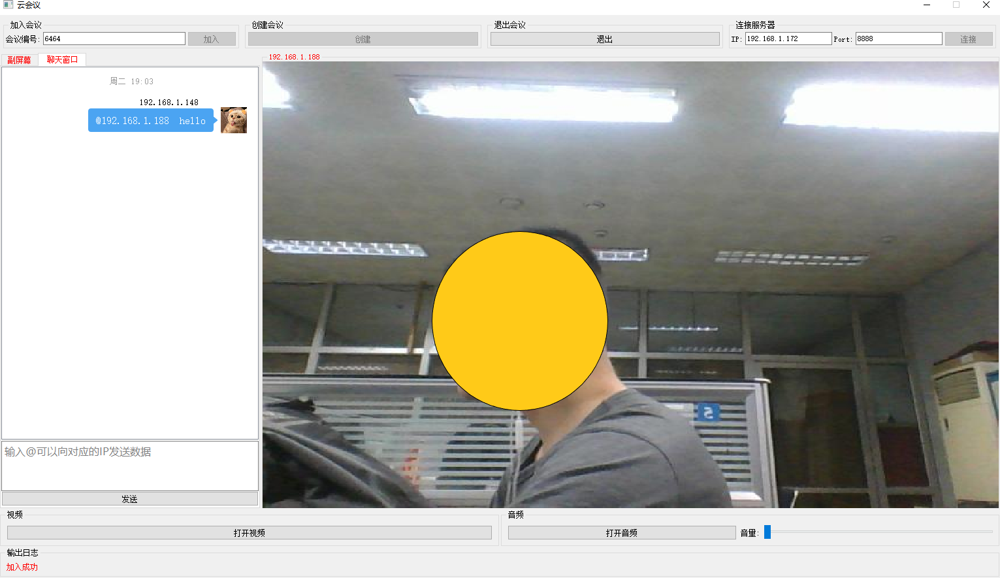
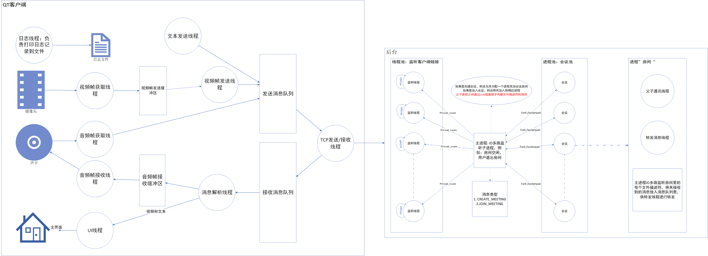

# CloudMeeting
客户端基于QT，可以传输视频，音频，同时可以传输文本。涉及信号与槽，多线程，socket通信，Tcp/IP包解析. 服务器端地址：https://github.com/muleimulei/CloudMeeting_Server

## 初始界面

#### 输入服务器端地址与端口，点击连接按钮就可以连接到服务器, 然后可以点击创建会议按钮或者加入会议按钮。当点击创建会议按钮时，服务器会发送一个空闲的房间号（其实就是进程号）。然后把房间号给别人，别人就可以连接服务器，加入会议

#### 点击打开视频，就可以开启摄像头，向别人共享你的图像

#### 点击打开音频，就可以打开输入音频，向别人说话。（默认打开输出音频，别人说的话自己可以听到）

#### 点击聊天窗口，用户可以输入信息，发往会议里的所有人

#### 用户也可以@特定用户，特定用户端会发出提示音

## 项目结构图

